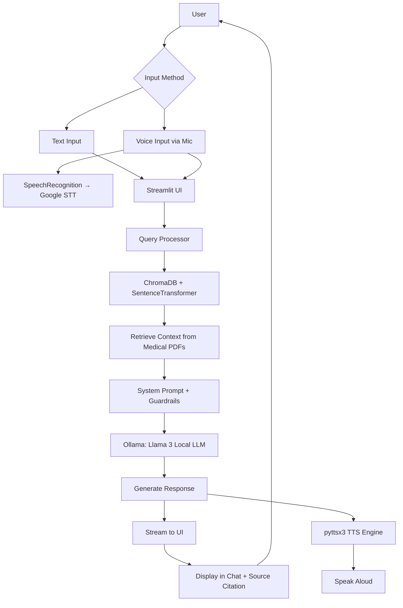

# 🩺 My Health Buddy+  
> *Your Local, Private, Voice-Enabled Healthcare Assistant with RAG*

**Developer**: Pugazhmani.K  
**License**: MIT License (see [License](#license))  
**Status**: ✅ Production Ready — Runs 100% Offline  
**Last Updated**: May 2025

---

## 🌟 Overview

**My Health Buddy+** is a **locally-run, LLM-powered healthcare chatbot** built with Python and Streamlit. It uses **Llama 3** for reasoning, **RAG (Retrieval-Augmented Generation)** from your own medical PDFs (e.g., encyclopedias, WHO/CDC guides), and supports **voice input/output** for hands-free interaction.

🔒 **No data leaves your machine. No API keys. No subscriptions.**

Perfect for personal use, privacy-conscious users, or offline environments.

---

## 🧩 Features

| Feature                  | Status     |
|--------------------------|------------|
| Local LLM (Llama 3)      | ✅          |
| RAG from Custom PDFs     | ✅          |
| Voice Input (STT)        | ✅ (Google) |
| Voice Output (TTS)       | ✅          |
| Source Citations         | ✅ Toggle   |
| Safety Guardrails        | ✅          |
| Streaming UI             | ✅          |
| Runs 100% Offline*       | ✅          |

> *Voice recognition currently uses Google (requires internet). Can be switched to VOSK for 100% offline — see Roadmap.

---

## 🖥️ System Architecture



---

## 📥 Installation Guide

### Prerequisites
- Python 3.9+
- [Ollama](https://ollama.com/)
- Windows/macOS/Linux

---

### Step 1: Setup Project
```bash
mkdir health-chatbot
cd health-chatbot
```

### Step 2: Setup Virtual Environment
```bash
python -m venv venv
source venv/bin/activate      # macOS/Linux
venv\Scripts\activate         # Windows
```

### Step 3: Install Dependencies
```bash
pip install streamlit ollama chromadb sentence-transformers pypdf langchain-core SpeechRecognition pyttsx3 pyaudio
```

💡 On Windows, if `pyaudio` fails:
```bash
pip install pipwin
pipwin install pyaudio
```

### Step 4: Pull Llama 3 Model
```bash
ollama pull llama3:8b-instruct-q4_K_M
# OR for lower RAM usage:
# ollama pull llama3:8b-instruct-q2_K
```

### Step 5: Add Medical PDFs
Create a `data/` folder and place your trusted medical PDFs inside:
```bash
mkdir data
# Example:
# cp ~/Downloads/who_healthy_diet.pdf data/
```

### Step 6: Run RAG Loader (One-Time)
```bash
python rag_loader.py
```
→ Embeds all PDFs into local ChromaDB.

### Step 7: Launch App
```bash
streamlit run app.py
```
→ Open [http://localhost:8501](http://localhost:8501) in your browser.

---

## 🎙️ Usage

- Toggle **“🎙️ Enable Voice I/O”** in the sidebar for voice interaction.  
- Ask questions like:
  - “What are symptoms of diabetes?”
  - “How to manage stress?”
  - “What’s a healthy diet?”

The bot retrieves relevant info from your PDFs → generates a safe answer → speaks it aloud.  

Toggle **“📚 Show Source Citations”** to see which document/page was used.  

---

## ⚠️ Important Disclaimer

This tool provides general health and wellness information only.  

❗ It is **NOT** a doctor. Do **NOT** use it for diagnosis, treatment, or medical advice.  
❗ Always consult a licensed healthcare provider.  
❗ In emergencies, call your local emergency number immediately.  

---

## 🧭 Future Roadmap

- ➕ Switch STT to VOSK for 100% offline voice recognition  
- ⏰ Add medication & appointment reminders  
- 📄 Export chat history to PDF/Text  
- 🌙 Dark Mode toggle  
- 📱 Mobile-responsive UI  
- 🧠 Support multiple LLMs (Mistral, Phi-3, etc.)  

---

## 🛠️ Troubleshooting

**❌ “Out of Memory” Error**  
→ Use smaller model:  
```bash
ollama pull llama3:8b-instruct-q2_K
```  
→ Reduce context in `app.py`: set `n_results=1` and truncate snippets to 200–300 characters.  

**❌ ChromaDB Embedding Errors**  
→ Ensure `LocalEmbeddingFunction` in both `app.py` and `rag_loader.py` includes:  
- `embed_query(self, *, input)` with keyword-only `input`  
- Returns `List[float]`, never a scalar  
- Uses fallback `[0.0] * 384` on error  

**❌ Voice Not Working**  
→ Check microphone permissions.  
→ Install `pyaudio` correctly (use `pipwin` on Windows).  
→ For 100% offline, implement **VOSK** (contact developer for upgrade).  

---

## 📜 License: MIT License

```
Copyright (c) 2025 Pugazhmani.K

Permission is hereby granted, free of charge, to any person obtaining a copy
of this software and associated documentation files (the "Software"), to deal
in the Software without restriction, including without limitation the rights
to use, copy, modify, merge, publish, distribute, sublicense, and/or sell
copies of the Software, and to permit persons to whom the Software is
furnished to do so, subject to the following conditions:

The above copyright notice and this permission notice shall be included in all
copies or substantial portions of the Software.

THE SOFTWARE IS PROVIDED "AS IS", WITHOUT WARRANTY OF ANY KIND, EXPRESS OR
IMPLIED, INCLUDING BUT NOT LIMITED TO THE WARRANTIES OF MERCHANTABILITY,
FITNESS FOR A PARTICULAR PURPOSE AND NONINFRINGEMENT. IN NO EVENT SHALL THE
AUTHORS OR COPYRIGHT HOLDERS BE LIABLE FOR ANY CLAIM, DAMAGES OR OTHER
LIABILITY, WHETHER IN AN ACTION OF CONTRACT, TORT OR OTHERWISE, ARISING FROM,
OUT OF OR IN CONNECTION WITH THE SOFTWARE OR THE USE OR OTHER DEALINGS IN THE
SOFTWARE.
```

---

## 🙏 Credits

- Developer: **Pugazhmani.K**  
- LLM: **Meta Llama 3 via Ollama**  
- Embeddings: `sentence-transformers/all-MiniLM-L6-v2`  
- Vector DB: **ChromaDB**  
- UI: **Streamlit**  
- TTS: **pyttsx3**  
- STT: **SpeechRecognition + Google Web Speech API**  

---

## 💬 Support

Found a bug? Want a new feature?  
→ Open an issue or contact **Pugazhmani.K** directly.  

---

🚀 **You’re All Set!**  
Run. Ask. Listen. Stay healthy — privately and locally.  

🩺 **My Health Buddy+** — because your health deserves privacy, accuracy, and care.  

> “The best healthcare is personalized, private, and powered by you.” — *Pugazhmani.K*  
